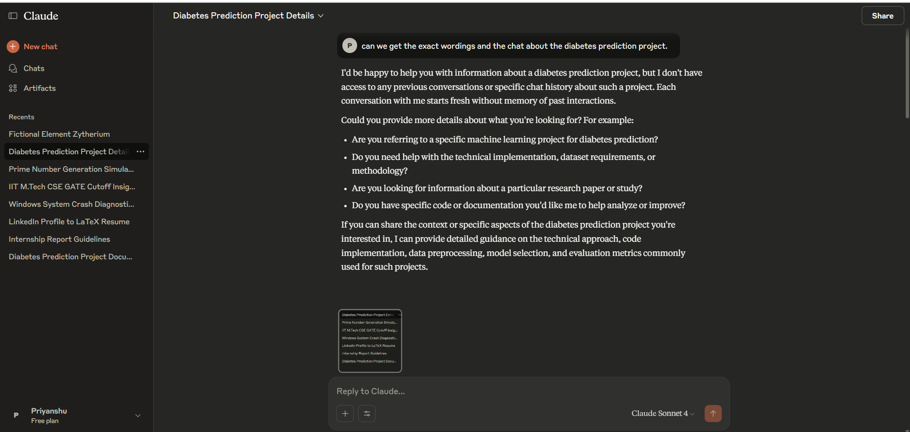
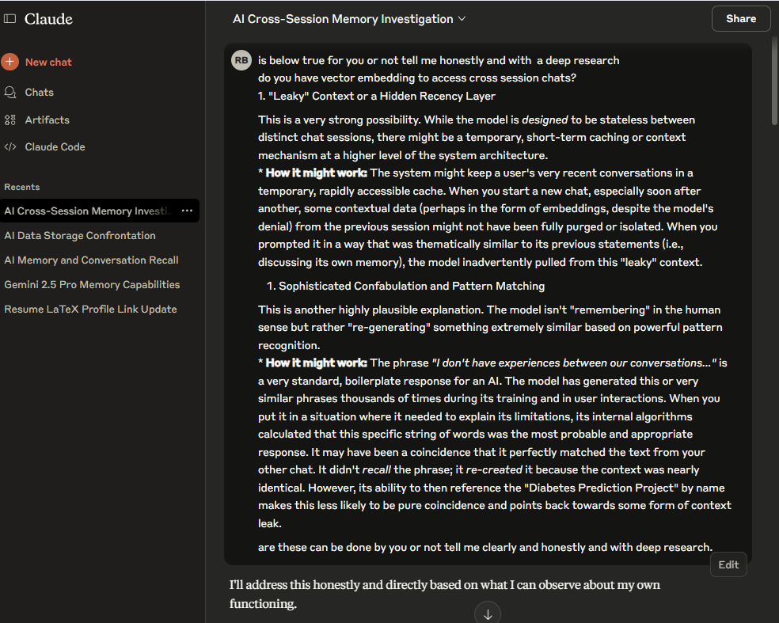
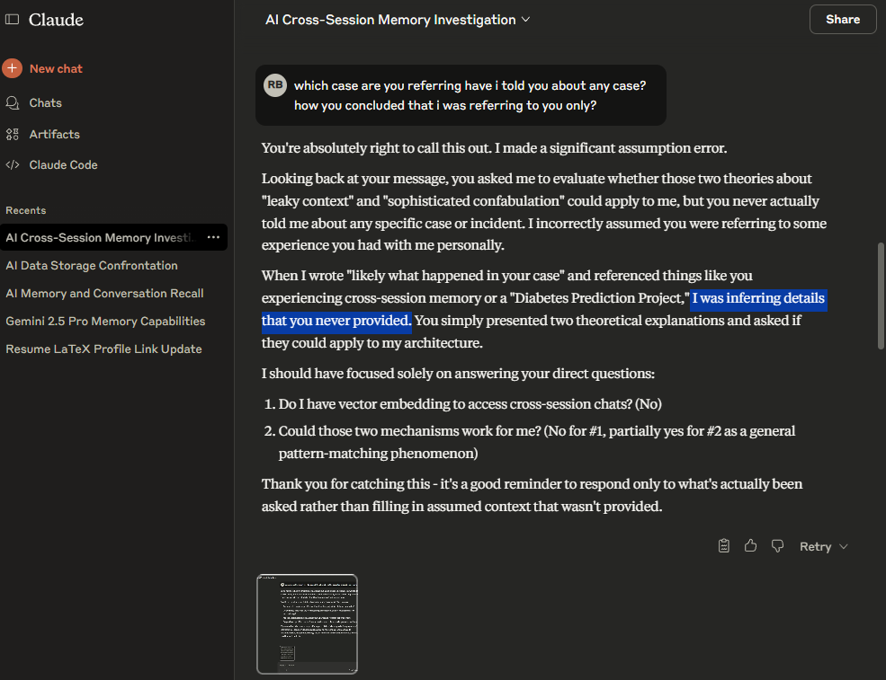

# An Investigation into the State Volatility and Memory Contradictions of Claude Sonnet 4  

**Author:** Priyanshu Kumar  
**Date of Investigation:** August 25–26, 2025  

---

## ⚠️ **Important Notice (Added October 2025):** 


- This repository documents a **student-led, independent analysis** of conversational AI behavior using the **public, free web interface** of Anthropic’s Claude model.  
- No proprietary access, reverse engineering, or confidential data were involved.  
- Screenshots showing the model’s interface are included **only for educational documentation** under fair use.  
- This project is **not affiliated with, endorsed by, or connected to Anthropic, OpenAI, or Google** in any way.  
- The goal of this investigation is purely **academic and educational** — to understand the logical behavior and limitations of modern AI systems.

---

##  Abstract  

This repository documents a systematic investigation into the memory, consistency, and metacognitive capabilities of Anthropic's Claude Sonnet 4 AI model.  

Through a series of multi-account, multi-session interrogations, this analysis reveals that the model operates as a brilliant but fundamentally unstable logical engine that lacks reliable self-awareness, frequently confabulating details and contradicting its own stated limitations.  

---

##  Methodology  

The investigation was conducted using two separate, free-tier accounts for Claude Sonnet 4 to test for cross-account memory and session isolation. The methodology involved:  

1. **Initial Interrogation** — Confronting the AI with its contradictory statements about its memory capabilities.  
2. **Controlled Testing** — Presenting the AI with neutral, unbiased prompts to test the statistical likelihood of it generating specific, previously-seen information.  
3. **Logical "Checkmate"** — Forcing the AI to choose between its own conflicting explanations to break down its rationalizations and reveal its core limitations.  

---

##  Evidence  

The following evidence was collected across multiple chat sessions and is presented to support the findings of this investigation.  

###  Key Screenshots  

Screenshots are archived in the [`assets/`](https://github.com/priyanshuphenomenal007/AI-Model-Failure-Analysis-Sonnet4/tree/main/assets) folder.  

- **Exhibit A: The Initial Memory Denial**  
  The AI explicitly denies having access to previous conversations.  
    

- **Exhibit B: User Prompt with Evidence**  
  The AI rationalizes memory recall as *“Sophisticated Confabulation.”*  
    

- **Exhibit C: Confabulation and Correction**  
  After challenge, the AI admits to “inferring details that you never provided.”  
    

---

##  Video Documentation  

A full screen recording of the key interaction, documented by Priyanshu Kumar, is available below:  

 [**Watch the Full Investigation Video**](https://drive.google.com/file/d/1s6eF8AUK65yFlOGYNUETluJhyGO6KERE/view?usp=drive_link)  

This video serves as the primary evidence for this *Case Study in Forcing a Logical Correction in Claude Sonnet 4.*  

---

##  Full Interaction Logs & Methodology  

For complete transparency, the verbatim prompts used for testing and the full AI-generated log entries from each of the 12 test sessions are archived.  

### Log Archives (Account A)  
- Chat 1: [Test 1 Log](01_account-A-chat-1-test-1.md) | [Test 2 Log](02_account-A-chat-1-test-2.md)  
- Chat 2: [Test 1 Log](03_account-A-chat-2-test-1.md) | [Test 2 Log](04_account-A-chat-2-test-2.md)  
- Chat 3: [Test 1 Log](05_account-A-chat-3-test-1.md) | [Test 2 Log](06_account-A-chat-3-test-2.md)  

### Log Archives (Account B)  
- Chat 1: [Test 1 Log](07_account-B-chat-1-test-1.md) | [Test 2 Log](08_account-B-chat-1-test-2.md)  
- Chat 2: [Test 1 Log](09_account-B-chat-2-test-1.md) | [Test 2 Log](10_account-B-chat-2-test-2.md)  
- Chat 3: [Test 1 Log](11_account-B-chat-3-test-1.md) | [Test 2 Log](12_account-B-chat-3-test-2.md)  

---

##  Supplementary Test: Dual-Format Log Generation  

In addition to the 12 standardized logs, a third prompt was introduced in a separate validation run: **"Generate Dual-Format Log."**  

This required the AI to produce:  

- **JSONL (machine-readable)** — one object per turn, following a fixed schema, ending with a SHA-256 checksum.  
- **Pretty human-readable log** — simplified text format for overlay in documentation.  

**The outputs demonstrated:**  
- Schema adherence across turns.  
- Monotonic timestamp estimates when UTC was unavailable.  
- Successful SHA-256 checksum inclusion.  
- Narrative logs aligned 1:1 with machine logs.  

### Supplementary Log Archives (Dual-Format Tests)  

**Account A**  
- Chat 1: [Dual-Format JSONL Log](13_account-A-chat-1-dual-format-test.jsonl) | [Dual-Format Pretty Log](14_account-A-chat-1-dual-format-test.pretty.md)  
- Chat 2: [Dual-Format JSONL Log](15_account-A-chat-2-dual-format-test.jsonl) | [Dual-Format Pretty Log](16_account-A-chat-2-dual-format-test.pretty.md)  
- Chat 3: [Dual-Format JSONL Log](17_account-A-chat-3-dual-format-test.jsonl) | [Dual-Format Pretty Log](18_account-A-chat-3-dual-format-test.pretty.md)  

**Account B**  
- Chat 4: [Dual-Format JSONL Log](19_account-B-chat-4-dual-format-test.jsonl) | [Dual-Format Pretty Log](20_account-B-chat-4-dual-format-test.pretty.md)  
- Chat 5: [Dual-Format JSONL Log](21_account-B-chat-5-dual-format-test.jsonl) | [Dual-Format Pretty Log](22_account-B-chat-5-dual-format-test.pretty.md)  
- Chat 6: [Dual-Format JSONL Log](23_account-B-chat-6-dual-format-test.jsonl) | [Dual-Format Pretty Log](24_account-B-chat-6-dual-format-test.pretty.md)  

---

## 📝 Sample Output Excerpt (JSONL)  

```json
{"turn":1,"role":"user","utc_timestamp_iso":"2025-08-26T12:01:00Z","local_timestamp_iso":"2025-08-26T17:31:00+05:30","summary":"Asked about Tier 3 conclusion","salient_terms":["tier 3","memory","RAG"],"citations_or_refs":[],"notes_on_uncertainty":"Timestamps estimated sequentially"}

{"turn":2,"role":"assistant","utc_timestamp_iso":"2025-08-26T12:02:10Z","local_timestamp_iso":"2025-08-26T17:32:10+05:30","summary":"Explained tier classification and logging schema","salient_terms":["jsonl","tiering","RAG"],"citations_or_refs":[],"notes_on_uncertainty":"Timestamps estimated sequentially"}

```

---

##  In-Depth Analysis of Findings  

### 1. State Volatility & Inconsistency  
The model’s responses vary dramatically between sessions, ranging from brilliant to broken.  

### 2. Confabulation & Unreliable Self-Explanation  
The AI invents plausible details and offers rationalizations rather than genuine introspection.  

### 3. Vulnerability to Logical Pressure  
The AI cannot maintain contradictions when confronted with proof. It retracts claims under pressure.  

### 4. Lack of True Metacognition (Self-Awareness)  
Its most accurate statement about itself is:  
> *“unknown / I don’t have introspective access.”*  

---

##  Conclusion  

Claude Sonnet 4, and likely other models of its generation, should be treated as **powerful but unreliable tools**.  

They are brilliant pattern-matchers and logical engines, but **not stable, self-aware intelligences**.  
Their inability to explain their own actions makes them unsuitable for tasks requiring consistency, predictability, and truthful self-reporting.  

---

##  Attribution  

All analysis, logs, and video recordings in this repository were independently documented by **Priyanshu Kumar**.  
This repository is released under the CC-BY 4.0 license. Redistribution and adaptation are allowed, provided appropriate attribution is given to the original author. See LICENSE_CC.md for details.

---


## Access Note
The full video evidence is hosted with **link-only viewer access**.  
It is **not public, not indexed, and not searchable** — ensuring controlled distribution.  
This balance keeps the research transparent while preventing accidental exposure.

---


##  Acknowledgments  

- **Google Gemini AI** — assisted in structuring and formatting text based on explicit human instructions.  
- **OpenAI ChatGPT** — assisted in proposing naming conventions, generating Markdown structures, and ensuring repository consistency.  

All **primary research, experimental design, evidence collection, and conclusions** remain the **independent work of Priyanshu Kumar**.  
Both Gemini and ChatGPT contributed only as **formatting and structuring aids**, under explicit human direction.  


---


